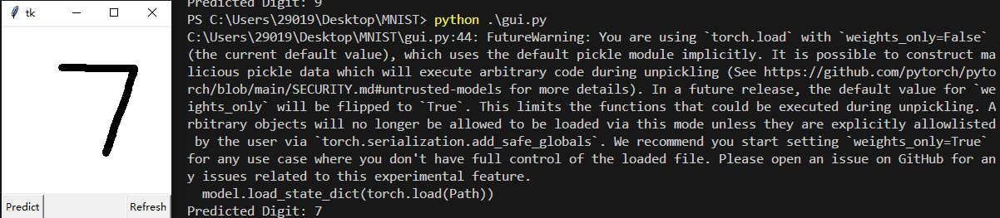

## MNIST-GUI

### cd MNIST
### run code python .\gui.py
#### draw the num and push predict button, use refresh button if you want try again! 
### main.py is the model train file and model.pth is the saved model

